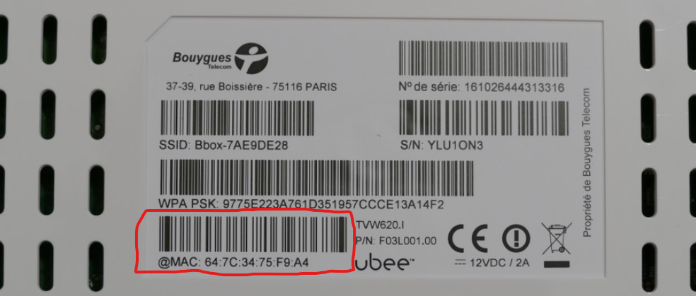

# Ubiquity Unifi Security Gateway (USG) Configuration for Bouygues Telecom With IPTV

## Global design
```
           Fiber
             +
             |
             |
             |
     +-------+-------+
     |               |
     | ONT Bouygues  |
     |               |
     +-------+-------+
             |
             |
             |
     vlan100 internet/IPTV
             |
             |
          +--+--+
          |     |
          | USG |
          |     |
          ++---++
     LAN1  |   |   LAN2
     +-----+   +------+
     |                |
     |                |
     |                |
+----+----+      +----+----+
|         |      |         |
| Switch  |      |  BOX TV |
|         |      |         |
+---------+      +---------+

```

## Prerequisites

2.  Have a Ubiquity Unifi Controller running. If not, see: [https://github.com/jacobalberty/unifi-docker](https://github.com/jacobalberty/unifi-docker)
3.  Adopt, provision and upgrade your USG.
4.  Configure you're internal LAN setup (IP range(s) / DHCP / AP's / etc.).
5.  Connect the USG WAN port (eth0) to the ONT of Bouygues Telecom.
6.  Connect the USG LAN1 port (eth1) to the Managed Switch.
7. Connect the USG LAN2 port (eth2) to the BBox TV.
8. Create Network LAN2 with DHCP 192.168.3.0/28 Address.
9. Assign 192.168.3.6 address to BBox TV

# Creating the _config.gateway.json_ File

By default, the _config.gateway.json_ file doesn't exist, it has to be created in order to use it.

1. Create a new file using a text editor such as VScode or Notepad++ and copy the config.gateway.json to this repository

2. Change in your **config.gateway.json** ```XX:XX:XX:XX:XX:XX``` and add the mac address of your BBOX 



3. Once the contents of the file has been validated, save it by naming it **config.gateway.json** and placing it under the **<unifi_base>/data/sites/site_ID** directory stored on the Controller.

>  **User Tip:** Depending on your operating system, placing the file under this directory might be as simple as drag and drop, or using a FTP server might be necessary. The **config.gateway.json** file must have unifi:unifi as the owner and group permissions. You can check to verify with `ls -l <unifi_base>/data/sites/site_ID`. To change it, once you're in the site directory, use the command: `chown unifi:unifi config.gateway.json`

# Testing & Verification

It's recommended to validate the code once finished creating the _config.gateway.json_. There are a number of free options out there, jsonlint.com is used by the Ubiquiti support team quite often.

After adding the _config.gateway.json_ to the Controller site of your choosing, you can test it by running a "force provision" to the USG in the **UniFi Controller Devices > USG > Config > Manage Device > Force provision**. This will take a while to provision (30 seconds to 3 minutes), and if it stays in provisioning longer than that, there may be a formatting error in the _config.gateway.json,_ and you are experiencing the provisioning loop that was mentioned earlier. You can check `server.log` in the controller and search for `commit error`. You can usually find what went wrong with the provisioning of the newly customized configuration in the log files.

> **User Tip:** An easy way to test the validity of the json file is: python -m json.tool config.gateway.json


